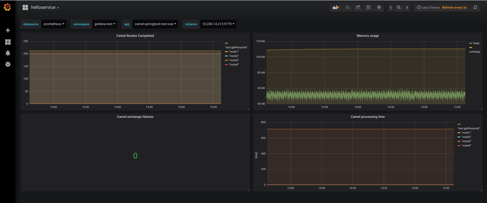
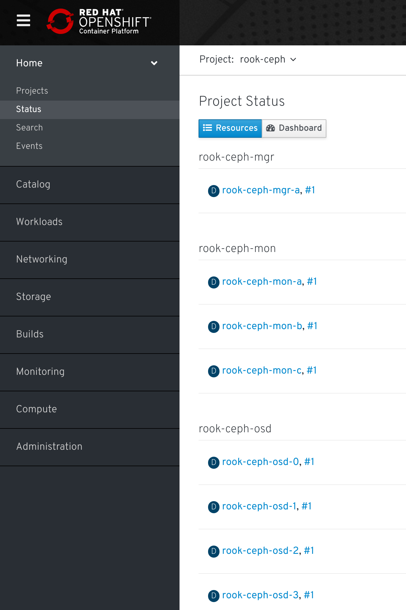
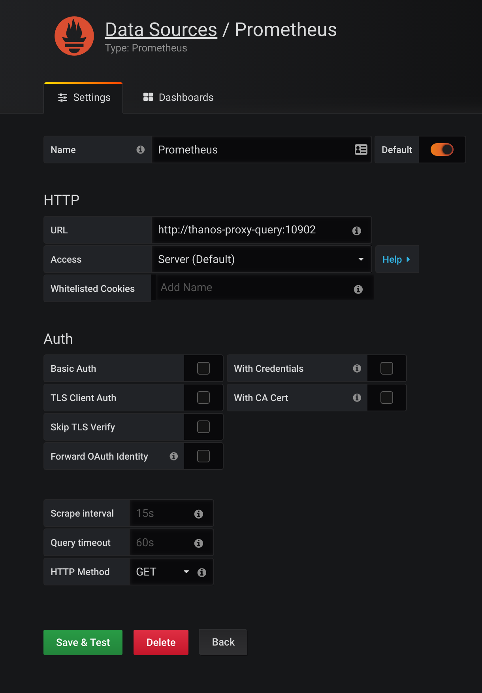
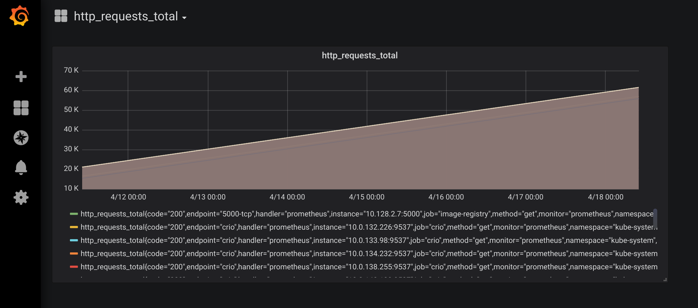
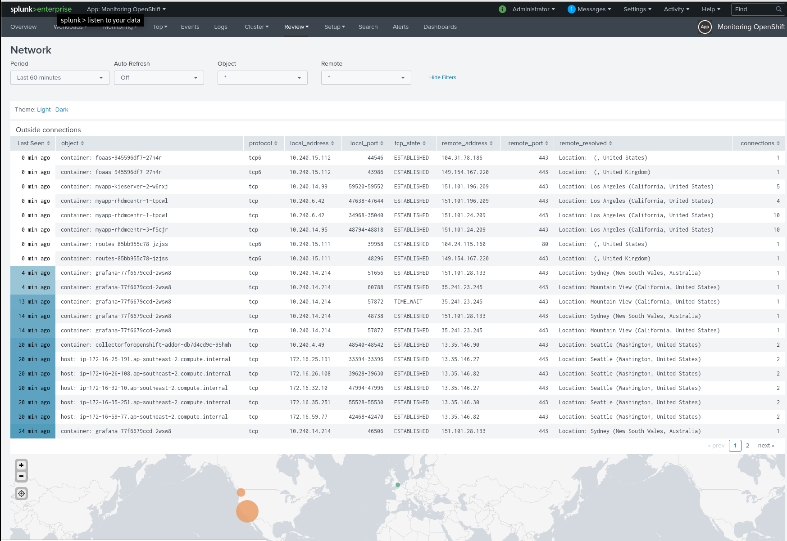
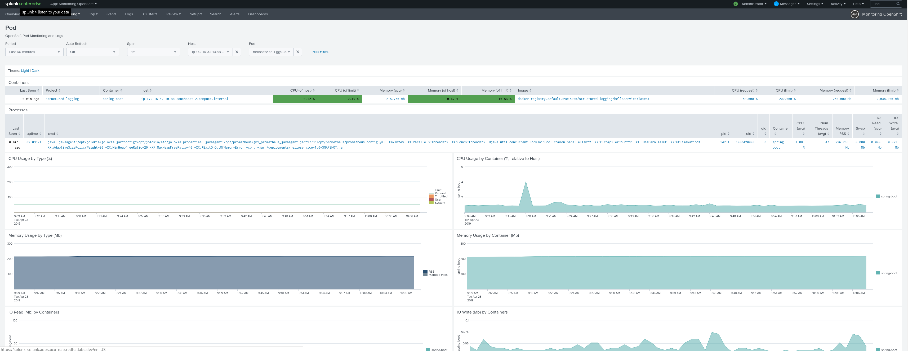
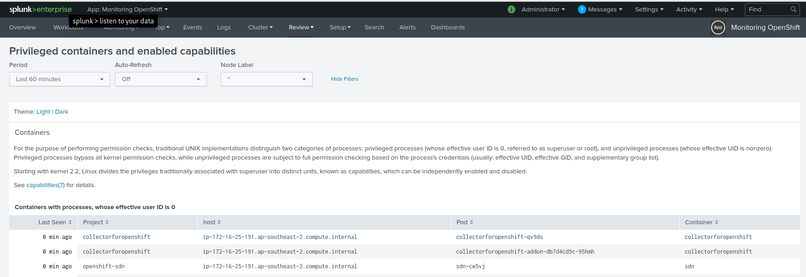
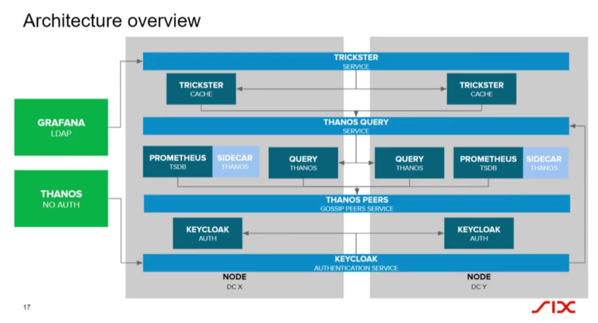

# OpenShift Observability Stack

There are 3 general areas for Observability of applications. Currently this is performed by

- Monitoring
- Log analysis
- Tracing

We will examine some tools to perform these functions as part of a Proof of Concept atop OpenShift.

## Monitoring Stack

Prometheus only stores a (configurable) amount of metrics data.

A full scalable production stack requires a set of components that can be composed into a highly available  metric system with unlimited storage capacity.

[Thanos](https://github.com/improbable-eng/thanos) is an opensource project that can be added seamlessly on top of existing Prometheus deployments to provide this scaling layer.

Object storage is provided by [rook.io](https://rook.io/) which is based on ceph and provides an S3 endpoint to Thanos.

```
   x--------------------x
---| Grafana Dashboard  |
|  x--------------------X
|
|  x--------------------x   x--------------------x
|  | Prometheus Metrics |---|    Applications    |
|  x--------------------X   x--------------------x
|            |
|  x--------------------x
|->|   Thanos Scaling   |
   x--------------------X
             |
   x--------------------x
   |   rook.io Storage  |
   x--------------------X
```

The initial proof of concept will be deployed using NFS. Object Storage and software defined storage will be required for long term storage and requires storage design and requirements gathering.

## Prometheus

Deploy a standalone prometheus using OpenShift example templates.

In future 4.X versions of OpenShift the prometheus operator will become supported for standalone monitoring of applications (i.e. can deploy a multi-tenant prometheus operator for application stack). A blog discussing how this will look is here - https://coreos.com/blog/the-prometheus-operator.html

We start with the default prometheus OpenShift example template

```
wget https://raw.githubusercontent.com/openshift/origin/master/examples/prometheus/prometheus-standalone.yaml
```

We have adjusted the template to allow the `prom` service account to scrape our application endpoints and use the provided images available in our cluster.

```
# Add ClusterRole and ClusterRoleBinding
- apiVersion: rbac.authorization.k8s.io/v1
  kind: ClusterRole
  metadata:
    name: prometheus-scraper
  rules:
  - apiGroups: [""]
    resources:
    - services
    - endpoints
    - pods
    verbs: ["get", "list", "watch"]
  - apiGroups:
    - route.openshift.io
    resources:
    - routers/metrics
    verbs:
    - get
  - apiGroups:
    - image.openshift.io
    resources:
    - registry/metrics
    verbs:
    - get
- apiVersion: authorization.openshift.io/v1
  kind: ClusterRoleBinding
  metadata:
    name: prometheus-scraper
  roleRef:
    name: prometheus-scraper
  subjects:
  - kind: ServiceAccount
    name: prom
    namespace: "${NAMESPACE}"

# Adjust the default images versions to use based on the current OpenShift cluster version
- description: The location of the proxy image
  name: IMAGE_PROXY
  value: openshift3/oauth-proxy:v3.11.82
- description: The location of the prometheus image
  name: IMAGE_PROMETHEUS
  value: openshift3/prometheus:v3.11.82
- description: The location of the alertmanager image
  name: IMAGE_ALERTMANAGER
  value: openshift3/prometheus-alertmanager:v3.11.82
- description: The location of alert-buffer image
  name: IMAGE_ALERT_BUFFER
  value: openshift3/prometheus-alert-buffer:v3.11.82
```

We will use a prometheus configuration file that allows us to scrape applications based on `Service` annotations. This allows a developer to annotate their service so that the exposed metrics are available to be scraped.

Login as an OpenShift that has cluster admin privilege (this is required to create ClusterRole and ClusterBindings)

Create a prometheus deployment.

```
# Create project to host our observability stack
oc new-project observability --display-name="Observability" --description="Observability"

# Create secrets containing configuration
oc create secret generic prom --from-file=./prometheus.yml
oc create secret generic prom-alerts --from-file=./alertmanager.yml
oc create -f ./prometheus-htpasswd-secret.yml

# Create the prometheus instance
oc process -f prometheus-standalone.yaml -p NAMESPACE=observability | oc apply -f -

# Allow view access to namespace for prom service account
oc policy add-role-to-user view system:serviceaccount:$(oc project -q):prom

# (Optional) if using OpenShift multitenant sdn plugin - check using:
oc get clusternetwork default --template='{{.pluginName}}'
redhat/openshift-ovs-multitenant

# Then we need to make prometheus global so it can be seen by all projects
oc adm pod-network make-projects-global observability
```

Prometheus and alert manager persistent data using nfs (size appropriately)

```
# prometheus persistent data

oc create -f - <<EOF
kind: PersistentVolumeClaim
apiVersion: v1
metadata:
  name: prometheus-data
spec:
  accessModes:
    - ReadWriteOnce
  resources:
    requests:
      storage: 5Gi
  storageClassName: netapp-nfs
EOF

oc set volume statefulsets/prom --add --overwrite -t persistentVolumeClaim --claim-name=prometheus-data --name=prometheus-data --mount-path=/prometheus

oc create -f - <<EOF
kind: PersistentVolumeClaim
apiVersion: v1
metadata:
  name: alertmanager-data
spec:
  accessModes:
    - ReadWriteOnce
  resources:
    requests:
      storage: 1Gi
  storageClassName: netapp-nfs
EOF

oc set volume statefulsets/prom --add --overwrite -t persistentVolumeClaim --claim-name=alertmanager-data --name=alertmanager-data --mount-path=/alertmanager
```

## Application

Deploy an example SpringBoot Application using FIS S2I image. The underlying fuse image already has configuration to make prometheus metrics available on port 9779.

The source code application is based here: https://github.com/eformat/camel-springboot-rest-ose

```
# Create an application project
oc new-project my-app

# If using mvn fabric8 plugin, deploy the app using
mvn fabric8:deploy

# If NOT not using fabric8 fragments to build and deploy, we can do these steps manually
oc new-app fuse-java-openshift:1.2~https://github.com/eformat/camel-springboot-rest-ose.git

oc delete svc camel-springboot-rest-ose
oc expose dc camel-springboot-rest-ose --name=camel-springboot-rest-ose --port=8080,8778,9779 --generator=service/v1

# expose route and set it on our swagger endpoint
oc expose svc camel-springboot-rest-ose --port=8080
oc set env dc/camel-springboot-rest-ose SWAGGERUI_HOST=$(oc get route camel-springboot-rest-ose --template='{{ .spec.host }}')

# Annotate our SpringBoot service so it can be scraped
oc annotate svc camel-springboot-rest-ose --overwrite prometheus.io/path='/prometheus' prometheus.io/port='9779' prometheus.io/scrape='true'
```

If the `jolokia/hawt.io` console is not available for the fuse application, check the deployment config has these ports enabled (edit and replace them)

```
          ports:
            - containerPort: 8778
              name: jolokia
              protocol: TCP
            - containerPort: 9779
              name: prometheus
              protocol: TCP
            - containerPort: 8080
              name: http
              protocol: TCP
```

## Grafana

The example template is here.

```
wget https://raw.githubusercontent.com/openshift/origin/master/examples/grafana/grafana.yaml -O grafana.yaml
```

We adjust the template to use the images available in OpenShift.

Deploy Grafana with persistent storage for data and graphs

```
# Switch back to monitoring project
oc project observability

# Create prometheus datasource
oc create secret generic grafana-datasources --from-file="prometheus.yaml=./grafana-prometheus-secret.json"

# Create a PVC for storing grafana dashboards and configuration
oc create -f - <<EOF
kind: PersistentVolumeClaim
apiVersion: v1
metadata:
  name: grafana-data
spec:
  accessModes:
    - ReadWriteOnce
  resources:
    requests:
      storage: 1Gi
  storageClassName: netapp-nfs
EOF

# Create standalone grafana
oc new-app -f grafana.yaml -p NAMESPACE=$(oc project -q)

# Allow Ouath delegation
oc adm policy add-cluster-role-to-user system:auth-delegator -z grafana -n observability

# Add datasource and data volumes to pod
oc set volume deployment/grafana --add --overwrite -t secret --secret-name=grafana-datasources --name=grafana-datasources --mount-path=/etc/grafana/provisioning/datasources --overwrite
oc set volume deployment/grafana --add --overwrite -t persistentVolumeClaim --claim-name=grafana-data --name=grafana-data --mount-path=/var/lib/grafana --overwrite
```

## Examples

Login to grafana and Import the `helloservice-grafana-dashboard.json` dashboard. Try scaling the Application pod to 2 manually, you should see metrics being collected in prometheus and grafana. If you browse to the root URL of the Application, you can try out the `hello` swagger API endpoints to generate metrics traffic.



## Tracing Stack

```
   x--------------------x   x--------------------x
   |  Jaeger Tracing    |---|    Applications    |
   x--------------------X   x--------------------x
             |
   x--------------------x
   | Cassandra Storage  |
   x--------------------X
```

[Opentracing](https://opentracing.io/) contains vendor-neutral APIs and instrumentation for distributed tracing.

Production deployment is documented [here](https://github.com/jaegertracing/jaeger-openshift#production-setup) where Cassandra or Elasticsearch can be used as backing storage for the Jaeger Collector and Query.

The `Jaeger` all-in-one deployment suitable for development and testing can be downloaded here

```
wget https://raw.githubusercontent.com/jaegertracing/jaeger-openshift/master/all-in-one/jaeger-all-in-one-template.yml
```

We can deploy Jaeger Opentracing into OpenShift using

```
oc project observability
oc process -f ./jaeger-all-in-one-template.yml | oc create -f -
```

Set the Application's Jaeger endpoint in the deploymentconfig

```
oc project my-app
oc set env dc/camel-springboot-rest-ose JAEGER_ENDPOINT=http://jaeger-collector.observability.svc.cluster.local:14268/api/traces
```

## Ceph / rook.io

Ceph was not deployed as part of the PoC, but here are instructions for reference using rook.io

- https://blog.openshift.com/rook-container-native-storage-openshift/
- https://rook.io/
- https://medium.com/@karansingh010/rook-ceph-deployment-on-openshift-4-2b34dfb6a442

```
# deploy
git clone https://github.com/ksingh7/ocp4-rook.git
cd ocp4-rook/ceph

oc create -f scc.yaml
oc create -f operator.yaml
watch "oc get pods -n rook-ceph-system"

oc create -f cluster.yaml
watch "oc get pods -n rook-ceph"

oc -n rook-ceph get service

oc create -f toolbox.yaml
oc get pods -n rook-ceph

# login to ceph
oc -n rook-ceph exec -it rook-ceph-tools bash ceph -s

# access ceph as s3
cd ~/git/ocp4-rook/object-access
oc create -f object.yaml

oc -n rook-ceph get pod -l app=rook-ceph-rgw
oc -n rook-ceph get services

oc create -f object-user.yaml
oc -n rook-ceph get secrets

oc -n rook-ceph describe secret rook-ceph-object-user-object
oc -n rook-ceph get secret rook-ceph-object-user-object-object -o yaml | grep AccessKey | awk '{print $2}' | base64 --decode

51M55U6YMKBX17CP9H8K

oc -n rook-ceph get secret rook-ceph-object-user-object-object -o yaml | grep SecretKey | awk '{print $2}' | base64 --decode

OAPi0PsqbqENnurn7EMbsSmXb9INAoXj28iFM0uD

# try it out
oc -n rook-ceph exec -it rook-ceph-tools bash

# s3 cli
export AWS_HOST=rook-ceph-rgw-object:8081
export AWS_ENDPOINT=172.30.6.131:8081
export AWS_ACCESS_KEY_ID=51M55U6YMKBX17CP9H8K
export AWS_SECRET_ACCESS_KEY=OAPi0PsqbqENnurn7EMbsSmXb9INAoXj28iFM0uD

# get route
oc -n rook-ceph get svc
oc -n rook-ceph expose svc/rook-ceph-rgw-object 
oc -n rook-ceph get route | awk '{ print  $2 }'

rook-ceph-rgw-object-rook-ceph.apps.cluster-8bb4.8bb4.openshiftworkshop.com

# create s3 bucket for thanos
s3cmd mb --access_key=51M55U6YMKBX17CP9H8K --secret_key=OAPi0PsqbqENnurn7EMbsSmXb9INAoXj28iFM0uD --no-ssl --host=rook-ceph-rgw-object-rook-ceph.apps.cluster-8bb4.8bb4.openshiftworkshop.com --host-bucket= s3://THANOS

# list s3 bucket
s3cmd --access_key=51M55U6YMKBX17CP9H8K --secret_key=OAPi0PsqbqENnurn7EMbsSmXb9INAoXj28iFM0uD --no-ssl --host=rook-ceph-rgw-object-rook-ceph.apps.cluster-8bb4.8bb4.openshiftworkshop.com --host-bucket="%(bucket)s.rook-ceph-rgw-object-rook-ceph.apps.cluster-8bb4.8bb4.openshiftworkshop.com" ls

2019-04-07 07:57  s3://THANOS
2019-04-07 07:44  s3://rookbucket

# test put
s3cmd --access_key=51M55U6YMKBX17CP9H8K --secret_key=OAPi0PsqbqENnurn7EMbsSmXb9INAoXj28iFM0uD --no-ssl --host=rook-ceph-rgw-object-rook-ceph.apps.cluster-8bb4.8bb4.openshiftworkshop.com put anaconda-ks.cfg s3://THANOS/anaconda-ks.cfg

# list objects in bucket
s3cmd --access_key=51M55U6YMKBX17CP9H8K --secret_key=OAPi0PsqbqENnurn7EMbsSmXb9INAoXj28iFM0uD --no-ssl --host=rook-ceph-rgw-object-rook-ceph.apps.cluster-8bb4.8bb4.openshiftworkshop.com ls s3://THANOS

# size of bucket
s3cmd --access_key=51M55U6YMKBX17CP9H8K --secret_key=OAPi0PsqbqENnurn7EMbsSmXb9INAoXj28iFM0uD --no-ssl --host=rook-ceph-rgw-object-rook-ceph.apps.cluster-8bb4.8bb4.openshiftworkshop.com du -H s3://THANOS
```



## Thanos

Thanos was not deployed as part of the PoC, but here are instructions for reference

- https://github.com/improbable-eng/thanos
- https://github.com/eformat/thanos-openshift

Git clone the repo above. Deploy

```
oc new-project thanos
oc process -f ./prometheus_thanos_full.yaml --param NAMESPACE=thanos --param THANOS_ACCESS_KEY=51M55U6YMKBX17CP9H8K --param THANOS_SECRET_KEY=OAPi0PsqbqENnurn7EMbsSmXb9INAoXj28iFM0uD | oc apply -f - 
```

Configure the configmap for s3 endpoint

```
- apiVersion: v1
   kind: ConfigMap
   metadata:
     name: thanos-config-store
     namespace: "${NAMESPACE}"
   data:
     ceph.yml: |-
       type: S3
       config:
           endpoint: 
rook-ceph-rgw-object-rook-ceph.apps.cluster-8bb4.8bb4.openshiftworkshop.com
           bucket: THANOS
           access_key: ${THANOS_ACCESS_KEY}
           secret_key: ${THANOS_SECRET_KEY}
           insecure: true
           signature_version2: false
           encrypt_sse: false
```

To get some prometheus data into storage using our thanos deployed prometheus, we can try using the `/federate` endpoint from the main openshift-monitoring prometheus

- https://prometheus.io/docs/prometheus/latest/federation/

```
# expose the openshift-monitoring prometheus service inside cluster cat <<EOF | oc -n openshift-monitoring create -f -
apiVersion: v1
kind: Service
metadata:
   creationTimestamp: null
   name: prom-fed
spec:
   ports:
   - name: prom-tcp
     port: 9090
     protocol: TCP
     targetPort: 9090
   sessionAffinity: None
   type: ClusterIP
   selector:
     app: prometheus
     prometheus: k8s
EOF

# edit thanos-prometheus-configmap.yaml to scrape from main prometheus

# federate
- job_name: 'federate'
   scrape_interval: 15s
   honor_labels: true
   metrics_path: '/federate'
   params:
     'match[]':
       - '{__name__=~"[a-z].*"}'
   static_configs:
     - targets:
       - 'prom-fed.openshift-monitoring.svc.cluster.local:9090'
```

We should now see data in thanos

```
s3cmd --access_key=51M55U6YMKBX17CP9H8K --secret_key=OAPi0PsqbqENnurn7EMbsSmXb9INAoXj28iFM0uD --no-ssl --host=rook-ceph-rgw-object-rook-ceph.apps.cluster-8bb4.8bb4.openshiftworkshop.com du -H s3://THANOS

4.103711389005184G 501 objects s3://THANOS/
```

To query the thanos endpoint from grafana

```
# expose query as service
cat <<EOF | oc -n thanos create -f -
apiVersion: v1
kind: Service
metadata:
   creationTimestamp: null
   name: thanos-proxy-query
spec:
   ports:
   - name: thanos-proxy-query
     port: 10902
     protocol: TCP
     targetPort: 10902
   sessionAffinity: None
   type: ClusterIP
   selector:
     app: thanos-query
EOF
```

Then set the prometheus datasource in grafana to use this service

```
# cat openshift-misc/grafana-wizzy/datasources/Prometheus.json
{
   "orgId": 1,
   "name": "Prometheus",
   "type": "prometheus",
   "typeLogoUrl": 
"public/app/plugins/datasource/prometheus/img/prometheus_logo.svg",
   "access": "proxy",
   "url": "http://thanos-proxy-query:10902",
   "password": "",
   "user": "",
   "database": "",
   "basicAuth": false,
   "isDefault": true,
   "jsonData": {
     "httpMethod": "GET",
     "keepCookies": [],
     "oauthPassThru": false,
     "tlsSkipVerify": false
   },
   "readOnly": false
}
```



We can see thanos querying across prometheus and s3 by looking at a weeks worth of data eventhough the prometheus statefulset is only configured to retain 6 hours of data:

```
    - '--storage.tsdb.retention=6h'
```



## Aggregated Logging

The default fluentd, EFK stack in OpenShift does not always meet all requirements (e.g. already having an enterprise wide third party logging solution such as Splunk). 

There are multiple ways to forward logs to external logging systems with OpenShift including:

- `secure fluentd forwarder` - OpenShift product - https://docs.openshift.com/container-platform/3.11/install_config/aggregate_logging.html (Red Hat supported)
- `fluentbit` - a log processors and forwarders e.g. https://fluentbit.io (community)
- `collectord` - https://www.outcoldsolutions.com/ (third party commercial)

Lets evaluate the splunk and outcold solutions on OpenShift (both have trial versions available that last for 30 days).

### Splunk

We can run the containerised version of splunk on OpenShift in a lab environment (no enterprise storage used, all-in-one container deployment). The docker image and documentation is here

- https://hub.docker.com/r/splunk/splunk/

To run on OpenShift, set an admin password

```
oc new-project splunk --display-name="Splunk" --description="Splunk"
oc new-app --name=splunk -lapp=splunk -e SPLUNK_START_ARGS=--accept-license -e SPLUNK_PASSWORD=password splunk/splunk:latest

oc adm policy add-scc-to-user anyuid -z default

oc set volume dc/splunk --add --overwrite -t emptyDir --name=state --mount-path=/opt/container_artifact
oc set volume dc/splunk --add --overwrite -t emptyDir --name=ansible --mount-path=/.ansible

oc expose svc splunk --port=8000
oc patch route/splunk -p '{"spec":{"tls":{"termination":"edge"}}}'
```

Once installed, we need to enable the splunk `HTTP Event Collector`. This is used by `collectord` to forward log events:

```
http://dev.splunk.com/view/event-collector/SP-CAAAE7F

Settings > Data inputs > HTTP Event Collector
```

Create a `token` that we will use for configuring `collectord`.

You can test the splunk http event collector is working by remote shell and sending a test event using the token:

```
oc rsh splunk-3-lg5qf
curl -k https://splunk:8088/services/collector/event/1.0 -H "Authorization: Splunk eba37d71-7e2b-4298-a70a-2637a5da962b" -d '{"event": "hello world"}'
{"text":"Success","code":0}
```

### Collectord

Outcold provide a log forwarder and collector called `containerd`. Full details are covered here

- https://www.outcoldsolutions.com/
- https://www.outcoldsolutions.com/docs/monitoring-openshift/v5

To install, first create a project

```
oc create -f - <<EOF
apiVersion: v1
kind: Project
metadata:
  labels:
    app: collectorforopenshift
  name: collectorforopenshift
  annotations:
          # openshift.io/node-selector: ''
          # openshift.io/description: 'Monitoring OpenShift in Splunk, built by Outcold Solutions'
          # openshift.io/display-name: 'Collector for OpenShift'
EOF
```

There are three tokens we need to gather before deploying.

To gain access to the Outcold images, login to the Red Hat partner registry `registry.connect.redhat.com`

- https://www.outcoldsolutions.com/docs/monitoring-openshift/v5/configuration/#registryconnectredhatcom-authentication

And add the docker config as a pull secret to your project

```
docker login registry.connect.redhat.com
Username: [redhat-username]
Password: [redhat-user-password]
Login Succeeded

oc --namespace collectorforopenshift secrets new rhcc .dockerconfigjson=$HOME/.docker/config.json
oc --namespace collectorforopenshift secrets link collectorforopenshift rhcc --for=pull
```

Edit the `collectorforopenshift.yaml` file in this repo and fill in the Splunk token created above:

```
    # Splunk HTTP Event Collector Token
    token = REPLACEME
```

Obtain a trial license from Outcold here

- https://www.outcoldsolutions.com/trial/request/

And replace this in the `collectorforopenshift.yaml` file

```
    # license key
    license = REPLACEME
```

Now deploy collectord and add `privileged` permissions for the service account

```
oc project collectorforopenshift
oc apply -f ./collectorforopenshift.yaml
oc adm policy add-scc-to-user privileged system:serviceaccount:collectorforopenshift:collectorforopenshift
```

Create a splunkbase free account so we can install the `"Monitoring OpenShift"` from the Apps > Browse More Apps menu

- https://splunkbase.splunk.com/app/3836/


You should now be able to search and see of the preconfigured dashboards and alerts that come with the `Monitoring OpenShift` app.

Check the docmentation links above for using collectord

- Annotations
- Audit
- Configuring Indexes
- Field extraction
- Multiple clusters
- Alerts








## Other Future Architecture

`Trickster` for proxy cache of prometheus metrics

- https://github.com/Comcast/trickster

`SSO` Layer, from SIX Architecture in OpenShift Commons



## Reference - Great Blog Posts

360° Observability of Camel Integrations in Red Hat OpenShift

- https://brunonetid.github.io/2019/07/09/camel-observability-openshift.html
